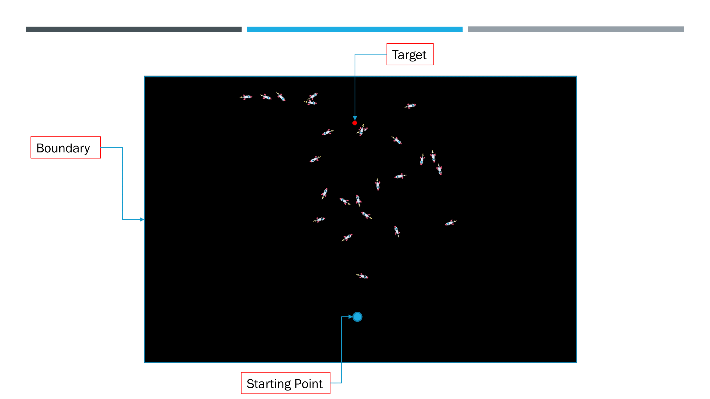

<!-- Improved compatibility of back to top link: See: https://github.com/othneildrew/Best-README-Template/pull/73 -->
<a name="readme-top"></a>

<!-- PROJECT SHIELDS -->

<div align="center">

[![LinkedIn][linkedin-shield]][linkedin-url]

</div>


<!-- PROJECT LOGO -->
<div align="center">
  <a href="https://github.com/Zulqarnain-cc34/Smart_Rockets">
    
  </a>

<h3 align="center">Smart Rockets</h3>

  <p align="center">
    This is a physics simulation of the genetic algorithm's implementation on rockets.
    <br />
    <a href="https://github.com/Zulqarnain-cc34/dotfiles"><strong>Explore the docs »</strong></a>
    
  </p>
</div>

<!-- TABLE OF CONTENTS -->
<details>
  <summary>Table of Contents</summary>
  <ol>
    <li>
      <a href="#about-the-project">About The Project</a>
      <ul>
        <li><a href="#built-with">Built With</a></li>
      </ul>
    </li>
    <li>
      <a href="#getting-started">Getting Started</a>
      <ul>
        <li><a href="#prerequisites">Prerequisites</a></li>
        <li><a href="#installation">Installation</a></li>
      </ul>
    </li>
    <li><a href="#roadmap">Roadmap</a></li>
    <li><a href="#license">License</a></li>
    <li><a href="#contact">Contact</a></li>
  </ol>
</details>


<!-- ABOUT THE PROJECT -->
## About The Project
<!--  [![Product Name Screen Shot][product-screenshot]](https://example.com) -->

  <a href="https://github.com/Zulqarnain-cc34/Smart_Rockets">
    
  </a>

This is an implementation which has some basic physics in which our entities rockets are improved with every successive try using the genetic algorithm. They are directed to go towards the target from their starting position.

<p align="right">(<a href="#readme-top">back to top</a>)</p>


<!-- GETTING STARTED -->
## Getting Started

This is an example of how you may give instructions on setting up your project locally.
To get a local copy up and running follow these simple example steps.

### Prerequisites

* pip 
  ```sh
  pip install pygame
  ```

### Installation

1. Clone the repo
   ```sh
   git clone https://github.com/Zulqarnain-cc34/Smart_Rockets.git
   ```
2. Install prerequisties packages
   ```sh
   pip install
   ```

<p align="right">(<a href="#readme-top">back to top</a>)</p>


<!-- ROADMAP -->
## Roadmap

- [ ] Fix the Code
- [ ] Add Gravity
- [ ] Change Time Variable to be infinity
- [ ] Point Scoring System


<!-- LICENSE -->
## License

Distributed under the MIT License. See `LICENSE.txt` for more information.


<!-- MARKDOWN LINKS & IMAGES -->
<!-- https://www.markdownguide.org/basic-syntax/#reference-style-links -->
[stars-shield]: https://img.shields.io/github/stars/github_username/repo_name.svg?style=for-the-badge
[stars-url]: https://github.com/Zulqarnain-cc34/stargazers
[license-shield]: https://img.shields.io/github/license/github_username/repo_name.svg?style=for-the-badge
[license-url]: https://github.com/Zulqarnain-cc34/Smart_Rockets/blob/main/LICENSE
[linkedin-shield]: https://img.shields.io/badge/-LinkedIn-black.svg?style=for-the-badge&logo=linkedin&colorB=555
[linkedin-url]: https://www.linkedin.com/in/muhammad-zulqarnain-a29664247 
[product-screenshot]: https://github.com/Zulqarnain-cc34/Smart_Rockets/tree/main/smartRockets.png


